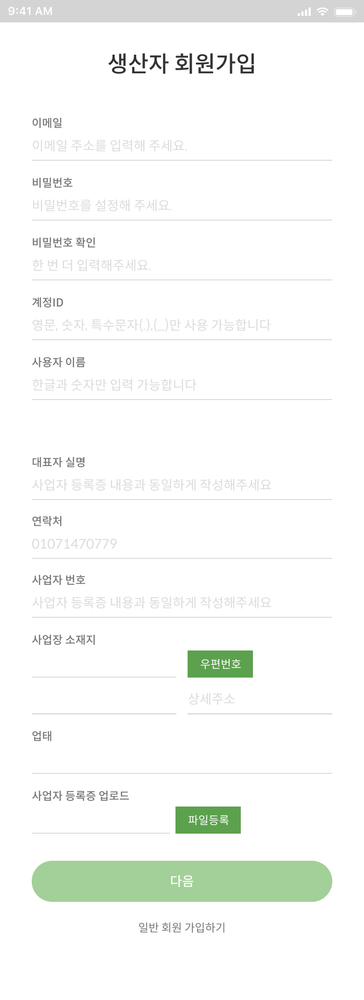

#  들바다 농수산물 마켓 플랫폼

> 농수산물 판매 및 구매와 SNS 기능을 결합한 모바일 최적화 마켓 플랫폼

**[🚀 배포 사이트 바로가기](https://deulbada.netlify.app/)**

**테스트 계정**

- ID: `test@test.com`
- PW: `test1234!`

<br>

## 목차

1. [프로젝트 개요](#1-프로젝트-개요)
2. [팀원 소개](#2-팀원-소개)
3. [프로젝트 기간](#3-프로젝트-기간)
4. [API 명세서](#4-api-명세서)
5. [기술 스택 및 개발 환경](#5-기술-스택-및-개발-환경)
6. [코드 컨벤션](#6-코드-컨벤션)
7. [커밋 컨벤션](#7-커밋-컨벤션)
8. [Git-flow Strategy](#8-git-flow-strategy)
9. [폴더 구조](#9-폴더-구조)
10. [개발 역할 및 담당 업무](#10-개발-역할-및-담당-업무)
11. [구현 페이지](#11-구현-페이지)
12. [주요 화면 구성](#12-주요-화면-구성-figma)
13. [프로젝트 회고](#13-프로젝트-회고)

<br>

## 1. 프로젝트 개요

들바다는 농수산물 판매 및 구매와 SNS 기능을 결합한 모바일 사이즈 최적화 플랫폼입니다.

> **📱 본 README는 들바다 서비스의 프론트엔드 개발 관련 정보를 다룹니다.**

**타겟층**

- 농수산물 판매 및 구매에 관심 있는 사용자
- SNS를 통해 일상을 공유하고 소통하고자 하는 사용자

React 기반으로 3명의 프론트엔드 개발자와 2명의 백엔드 개발자가 협업하여 개발한 프로젝트입니다. 효율적인 협업을 위해 코드 컨벤션과 Git-flow 전략을 도입하여 체계적으로 진행했습니다.

**백엔드 저장소**: [🔗 들바다 Backend Repository](https://github.com/BAEJUWAN5316/deulbada_BE)

**팀 1차 목표: 오픈 일정에 맞춘 안정적인 서비스 런칭**

<br>

## 2. 팀원 소개

| 이름       | 역할                    | 포지션                        |
| ---------- | ----------------------- | ----------------------------- |
| **주지은** | 팀장 & 개발자           | Frontend Developer            |
| **박다솜** | 개발자 & UI/UX 디자이너 | Frontend Developer & Designer |
| **김태훈** | 개발자                  | Frontend Developer            |
| **배주완** | 개발자                  | Backend Developer             |
| **정효운** | 개발자                  | Backend Developer             |

**팀 구성**

- Frontend 개발자 3명
- Backend 개발자 2명
- 총 5명으로 구성된 풀스택 개발팀

<br>

## 3. 프로젝트 기간

**2024년 7월 28일 ~ 8월 18일** (3주)

<br>

## 4. API 명세서

### 서버 및 문서

| 기능                   | HTTP Method | URL                 |
| ---------------------- | ----------- | ------------------- |
| JWT 토큰 발급 (로그인) | POST        | /api/token/         |
| JWT 토큰 갱신          | POST        | /api/token/refresh/ |
| JWT 토큰 유효성 검증   | POST        | /api/token/verify/  |

### 👤 사용자

| 기능                    | HTTP Method | URL                                         |
| ----------------------- | ----------- | ------------------------------------------- |
| 회원가입                | POST        | /api/users/signup/                          |
| 생산자 회원가입         | POST        | /api/users/signup/producer/                 |
| 로그인 (사용자 앱)      | POST        | /api/users/login/                           |
| 토큰 갱신 (사용자 앱)   | POST        | /api/users/token/refresh/                   |
| 이메일 중복 확인        | POST        | /api/users/check-email/                     |
| 계정 ID 중복 확인       | POST        | /api/users/check-account-id/                |
| 내 프로필 조회          | GET         | /api/users/mypage/                          |
| 프로필 초기 설정        | PUT/PATCH   | /api/users/mypage/profile/setup/            |
| 프로필 수정             | PUT/PATCH   | /api/users/mypage/profile/                  |
| 농장주 프로필           | GET         | /api/users/mypage/farm/                     |
| 사용자 프로필 상세 조회 | GET         | /api/users/profiles/{account_id}/           |
| 사용자 팔로워 목록      | GET         | /api/users/profiles/{account_id}/followers/ |
| 사용자 팔로잉 목록      | GET         | /api/users/profiles/{account_id}/following/ |
| 팔로우/언팔로우 토글    | POST        | /api/users/profiles/{account_id}/follow/    |
| 사용자 검색             | GET         | /api/users/search/                          |
| 내 게시글 목록          | GET         | /api/users/myposts/                         |
| 사용자 신고             | POST        | /api/users/report/                          |

### 📦 상품

| 기능                      | HTTP Method | URL                                 |
| ------------------------- | ----------- | ----------------------------------- |
| 태그 목록 조회            | GET         | /products/tags/                     |
| 상품 목록 조회            | GET         | /products/                          |
| 상품 생성                 | POST        | /products/                          |
| 카테고리별 상품 목록 조회 | GET         | /products/category/{category_name}/ |
| 사용자별 상품 목록 조회   | GET         | /products/user/{account_id}/        |
| 상품 상세 조회            | GET         | /products/{pk}/                     |
| 상품 수정                 | PUT/PATCH   | /products/{pk}/                     |
| 상품 삭제                 | DELETE      | /products/{pk}/                     |

### 💬 채팅

| 기능             | HTTP Method | URL                                 |
| ---------------- | ----------- | ----------------------------------- |
| 채팅방 목록 조회 | GET         | /chat/chatrooms/                    |
| 채팅방 생성      | POST        | /chat/chatrooms/                    |
| 채팅방 상세 조회 | GET         | /chat/chatrooms/{pk}/               |
| 채팅방 수정      | PUT/PATCH   | /chat/chatrooms/{pk}/               |
| 채팅방 삭제      | DELETE      | /chat/chatrooms/{pk}/               |
| 메시지 목록 조회 | GET         | /chat/chatrooms/{room_id}/messages/ |
| 메시지 생성      | POST        | /chat/chatrooms/{room_id}/messages/ |
| 채팅 테스트 뷰   | GET         | /chat/chat-test/                    |

**Base URL**: `https://deulbada.duckdns.org`

<br>

## 5. 기술 스택 및 개발 환경

### Frontend

- **React** - 컴포넌트 기반 UI 라이브러리
- **Styled Components** - CSS-in-JS 스타일링
- **Lucide** - 아이콘 라이브러리

**백엔드 상세 기술 스택 및 API 문서**: [📋 Backend Repository 참고](https://github.com/BAEJUWAN5316/deulbada_BE)

<br>

## 6. 코드 컨벤션

### 디렉토리 구조

- 컴포넌트, 페이지, 훅, 유틸 등 목적에 따라 폴더 분리
- 파일명 및 폴더명은 **카멜케이스 (CamelCase)** 로 통일

```
/components/Button.jsx
/hooks/useAuth.js
/pages/HomePage.jsx
```

### 파일/컴포넌트 작성 규칙

- 하나의 컴포넌트는 하나의 디렉토리로 분리하고, 관련 파일은 해당 폴더에 함께 관리
- 파일 이름과 컴포넌트 이름 일치
- **화살표 함수 사용**

```jsx
const MyComponent = () => {
  return <div>...</div>;
};

export default MyComponent;
```

### 스타일 (styled-components)

- 스타일은 컴포넌트와 같은 폴더 내 작성
- 파일명: **컴포넌트명.style.js**
- 스타일 이름은 `Styled` 접두사 사용

```jsx
const StyledLogin = styled.section`
  /* styles */
`;
```

### 코드 스타일

- 세미콜론 사용 (`;`)
- JavaScript 코드는 작은 따옴표 (`'`) 사용
- JSX 값은 큰 따옴표 (`"`) 사용
- 불필요한 콘솔 로그는 커밋 전 제거

```jsx
<Route path="/login" element={<LoginLayout page={'login'} />} />
```

### 기타

- 주석은 필요한 곳에만 간결하게 작성
- 공통 변수는 `constants.js`, `theme.js` 등으로 분리
- 협업 시 PR 전 `eslint`/`prettier` 적용

<br>

## 7. 커밋 컨벤션

### 커밋 타입 정의

| 타입       | 설명                                                                |
| ---------- | ------------------------------------------------------------------- |
| `Add`      | 새로운 기능 추가                                                    |
| `Fix`      | 버그 수정 (단순 수정 제외)                                          |
| `Docs`     | 문서 수정                                                           |
| `Edit`     | 코드 포맷팅, 누락된 세미콜론 추가 등 기능 변경 없는 단순 style 수정 |
| `Refactor` | 리팩토링 (동작은 동일하되 코드 구조 개선 등)                        |
| `TestEdit` | 테스트 관련 코드 추가 및 삭제 등                                    |
| `Chore`    | 빌드 / 배포 / 환경설정 등 기능 외 작업                              |

### 커밋 메시지 예시

```
Add: 상품 상세 페이지 기능 추가
Fix: 로그인 시 에러 메시지 노출 오류 수정
Docs: README 배포 방법 설명 추가
Edit: 세미콜론 누락 수정 및 들여쓰기 정리
Refactor: 유저 인증 로직 리팩토링
TestEdit: 장바구니 기능 테스트 코드 추가
Chore: 리액트 프로젝트 구성
```

<br>

## 8. Git-flow Strategy

`main`과 `dev` 브랜치를 중심으로, 기능 및 페이지 단위로 `feature` 브랜치를 생성하여 작업하는 Git-flow 전략을 사용했습니다.

- 모든 코드는 **Pull Request**와 **동료 리뷰**를 한뒤 `dev` 브랜치에 병합
- 안정적인 배포를 위해 `main` 브랜치는 검증된 코드만 병합

<br>

## 9. 폴더 구조

```
📦src
┣ 📂api
┃ ┣ 📜api.js
┃ ┣ 📜authApi.js
┃ ┣ 📜postApi.js
┃ ┣ 📜productApi.js
┃ ┗ 📜userApi.js
┣ 📂assets
┃ ┗ 📂images
┣ 📂auth
┃ ┣ 📜authService.js
┃ ┣ 📜RequireAuth.jsx
┃ ┗ 📜tokenStore.js
┣ 📂components // JSX 컴포넌트와 해당 스타일이 함께 관리되는 재사용 가능한 컴포넌트들
┃ ┣ 📂actionSheet
┃ ┣ 📂badge
┃ ┣ 📂bottomNavBar
┃ ┣ 📂header
┃ ┣ 📂icon
┃ ┣ 📂loding
┃ ┣ 📂modalPopup
┃ ┣ 📂postContent
┃ ┣ 📂scrollTop
┃ ┗ 📂userInfo
┣ 📂context
┃ ┣ 📜LoadingContext.jsx
┃ ┣ 📜PageActionsContext.jsx
┃ ┣ 📜PopupContext.jsx
┃ ┗ 📜ThemeContext.jsx
┣ 📂hooks
┃ ┣ 📜useChatWS.js
┃ ┣ 📜useFeedActions.js
┃ ┣ 📜useHeaderAction.js
┃ ┣ 📜usePopupAction.js
┃ ┣ 📜useProfileRedirect.js
┃ ┗ 📜useScrollObserver.js
┣ 📂layout
┃ ┣ 📂commonLayout //기본 레이아웃
┃ ┗ 📂loginLayout  // 로그인 레이아웃
┣ 📂pages // 각 페이지 관련 소스들
┃ ┣ 📂chatList
┃ ┣ 📂chatRoom
┃ ┣ 📂followers
┃ ┣ 📂followings
┃ ┣ 📂guide
┃ ┣ 📂home
┃ ┣ 📂joinMembership
┃ ┣ 📂joinProducer
┃ ┣ 📂login
┃ ┣ 📂loginEmail
┃ ┣ 📂myProfileEdit
┃ ┣ 📂notFound
┃ ┣ 📂postDetail
┃ ┣ 📂postUpload
┃ ┣ 📂product
┃ ┣ 📂profile
┃ ┣ 📂profileSettings
┃ ┗ 📂search
┣ 📂styles // JSX 없이 스타일만 독립적으로 관리되는 공통 스타일 파일들
┃ ┣ 📜Button.style.js
┃ ┣ 📜Common.style.js
┃ ┣ 📜Container.style.js
┃ ┣ 📜font.js
┃ ┣ 📜Globalstyle.style.js
┃ ┗ 📜theme.js
┣ 📜App.jsx
┗ 📜main.jsx
```

<br>

## 10. 개발 역할 및 담당 업무

### 👨‍💻 주지은 (팀장)

**핵심 담당 영역**

- 전체적인 프로젝트 구조 설계
- 공통 컴포넌트 및 스타일 시스템 구축

**개발 담당 기능**

- 📱 홈 피드 화면 및 무한 스크롤 구현
- 🔍 통합 검색 기능 (사용자 검색)
- 👤 프로필 페이지 (본인/타인 프로필 뷰)
- 👥 팔로워/팔로잉 관리 시스템

### 👩‍💻 박다솜

**핵심 담당 영역**

- UXUI 리디자인
- 사용자 인증 시스템 전반
- 회원 관리 및 프로필 설정 기능
- UI/UX 예외 상황 처리

**개발 담당 기능**

- 🔐 로그인/로그아웃 시스템 구현
- ✨ 회원가입 (일반 회원/생산자 회원)
- 🛒 상품 등록 (생산자 전용)
- ⚙️ 프로필 설정 및 수정 기능
- 🚫 404 에러 페이지

### 👨‍💻 김태훈

**핵심 담당 영역**

- 실시간 통신 및 소셜 기능
- 콘텐츠 업로드 및 관리 시스템
- WebSocket 기반 채팅 구현

**개발 담당 기능**

- 💬 실시간 1:1 채팅 시스템
- 📸 이미지 업로드 및 게시글 작성
- 📝 게시글 상세 페이지 및 댓글 기능

### 🏆 팀 협업 성과

- **코드 품질**: 일관된 코드 컨벤션으로 유지보수성 향상
- **효율적 분업**: 각자의 강점을 살린 역할 분담으로 개발 속도 향상
- **안정적 배포**: Git-flow 전략과 코드 리뷰를 통한 버그 최소화
- **사용자 중심**: 모바일 퍼스트 설계로 최적화된 사용자 경험 제공

<br>

## 11. 구현 페이지

### 🚀 시작 화면 (Splash)

<div align="left">
  
</div>

**주요 기능**

- 브랜드 아이덴티티가 담긴 인트로 애니메이션
- 최초 방문자에게만 표시되는 웰컴 스크린
- 세션스토리지를 활용한 중복 실행 방지 로직

---

### 🔐 사용자 인증 시스템

#### 로그인

<div align="left">
  
  
</div>

**주요 기능**

- 이메일 기반 간편 로그인 시스템
- 실시간 입력값 검증 및 오류 메시지 표시
- 보안을 강화한 토큰 기반 인증 구현

#### 회원가입 - 일반 사용자

<div align="left">
  
  
</div>

**주요 기능**

- 직관적인 단계별 회원가입 프로세스
- 이메일 중복 검사 및 실시간 유효성 검증
- 비밀번호 강도 체크 및 확인 절차

#### 회원가입 - 생산자

<div align="left">
  
  
</div>

**주요 기능**

- 사업자 정보 및 농수산물 카테고리 선택
- 생산자 인증을 위한 추가 정보 수집

---

### ⚙️ 프로필 관리 시스템

#### 초기 프로필 설정

<div align="left">
  
</div>

**주요 기능**

- 회원가입 완료 후 필수 프로필 정보 설정
- 프로필 이미지 업로드 및 미리보기 기능

#### 프로필 편집

<div align="left">
  
</div>

**주요 기능**

- 언제든지 수정 가능한 유연한 프로필 관리
- 실시간 변경사항 미리보기
- 이미지 교체 및 삭제 기능

---

### 📱 메인 피드

<div align="left">
  
</div>

**주요 기능**

- **동적 콘텐츠 피드**: 팔로우한 사용자들의 최신 게시글 실시간 업데이트
- **카테고리별 필터링**: 농산물/수산물 탭으로 원하는 상품만 선별 조회
- **반응형 테마**: 선택한 카테고리에 따른 메인 컬러 자동 변경
- **무한 스크롤**: 끊김 없는 콘텐츠 탐색을 위한 페이지네이션 구현
- **인터랙션 기능**: 좋아요, 댓글 등 소셜 네트워킹 기능 통합

---

### 👤 프로필 페이지

<div align="left">
  
  
</div>

**주요 기능**

- **개인화된 프로필 뷰**: 본인/타인 프로필에 따른 차별화된 UI 제공
- **팔로우 시스템**: 원터치 팔로우/언팔로우 기능 및 실시간 상태 반영
- **게시물 표시 옵션**: 리스트형/갤러리형 레이아웃 선택으로 사용자 맞춤 경험
- **생산자 인증**: 생산자 계정 전용 배지 및 상품 진열 공간

---

### 👥 소셜 네트워킹

<div align="left">
  
</div>

**주요 기능**

- **팔로워 관리**: 나를 팔로우하는 사용자 목록 및 상호 팔로우 상태 확인
- **팔로잉 관리**: 내가 팔로우한 사용자 목록 및 언팔로우 기능
- **스마트 버튼**: 팔로우 상태에 따른 동적 버튼 표시 (팔로우/팔로잉/본인)
- **실시간 업데이트**: 팔로우 액션 즉시 반영 및 카운터 동기화
- **사용자 케이스 처리**: 본인 프로필에서 팔로우 버튼 비활성화
- **추천 시스템**: 팔로워의 팔로워 추천 등 확장 가능한 구조

---

### 🔍 통합 검색

<div align="left">
  
</div>

**주요 기능**

- **실시간 사용자 검색**: 닉네임, 아이디 기반 통합 검색 시스템
- **하이라이팅 기능**: 검색어와 일치하는 텍스트 자동 강조 표시
- **빈 결과 처리**: 검색 결과 없을 시 대체 UI 및 추천 검색어 제공
- **검색 히스토리**: 최근 검색어 저장 및 빠른 재검색 지원

---

### 🛒 상품 관리

<div align="left">
 
</div>

**주요 기능**

- **상품 등록**: 생산자 계정 전용 상품 업로드 기능
- **다중 이미지 지원**: 상품 사진 여러 장 등록 및 순서 조정
- **상품 정보 관리**: 가격, 설명, 카테고리 등 상세 정보 입력
- **농수산물 카테고리**: 전문화된 상품 분류 시스템

---

### 📝 콘텐츠 작성

<div align="left">
 
</div>

**주요 기능**

- **멀티미디어 포스팅**: 텍스트 + 다중 이미지 업로드 지원
- **실시간 미리보기**: 작성 중인 게시물의 실시간 프리뷰 제공
- **이미지 관리**: 다중 이미지 업로드, 순서 변경, 개별 삭제 기능
- **즉시 피드 반영**: 게시글 등록 완료 시 메인 피드에 실시간 업데이트
- **게시물 수정**: 기존 게시물 불러오기 및 내용 수정 기능
- **임시 저장**: 작성 중인 내용 자동 저장으로 데이터 유실 방지

---

### 💬 실시간 채팅

<div align="left">
 
</div>

**채팅 목록**

- **활성 채팅방 관리**: 참여 중인 모든 채팅방 목록 표시
- **마지막 메시지 프리뷰**: 각 채팅방의 최근 대화 내용 미리보기
- **상대방 정보**: 프로필 이미지, 닉네임 등 상대방 식별 정보
- **실시간 동기화**: WebSocket 연결로 새 메시지 즉시 반영

**채팅방**

- **실시간 메시징**: WebSocket 기반 즉석 메시지 송수신
- **사용자 친화적 UI**: 직관적인 말풍선 디자인 및 시간 표시

<br>

## 12. 주요 화면 구성 (Figma)

**[Figma 디자인 링크 바로가기](https://www.figma.com/design/D9Eh2A96gnPy84rSd2gdrR/-%ED%94%84%EB%A1%9C%EC%A0%9D%ED%8A%B8--SNS%EB%A7%88%EC%BC%93_%EB%93%A4%EB%B0%94%EB%8B%A4?node-id=0-1&p=f&t=02CuyfnnNSbCJOuI-0)**

모바일 최적화에 중점을 둔 직관적이고 사용자 친화적인 UI/UX 디자인을 적용했습니다.

<br>

## 13. 프로젝트 회고

### 성과

- **체계적인 협업**: 코드 컨벤션과 Git-flow 전략을 통해 효율적이고 안정적인 개발 프로세스 구축
- **기능적 완성도**: 농수산물 거래와 SNS 기능을 성공적으로 결합한 플랫폼 완성
- **팀워크**: 역할 분담을 통한 효과적인 협업으로 일정 내 프로젝트 완료

### 개선점

- **기능 확장성**: 더 많은 부가 기능들을 구현하지 못한 아쉬움 (알림 시스템, 결제 기능 등)
- **성능 최적화**: 이미지 로딩 및 데이터 캐싱 등 성능 개선 여지
- **사용자 경험**: 더욱 세밀한 UX 개선과 접근성 향상 필요
- **테스트 코드**: 안정성 향상을 위한 테스트 코드 작성 부족

앞으로 이러한 개선점들을 보완하여 더욱 완성도 높은 서비스로 발전시켜 나갈 계획입니다.
